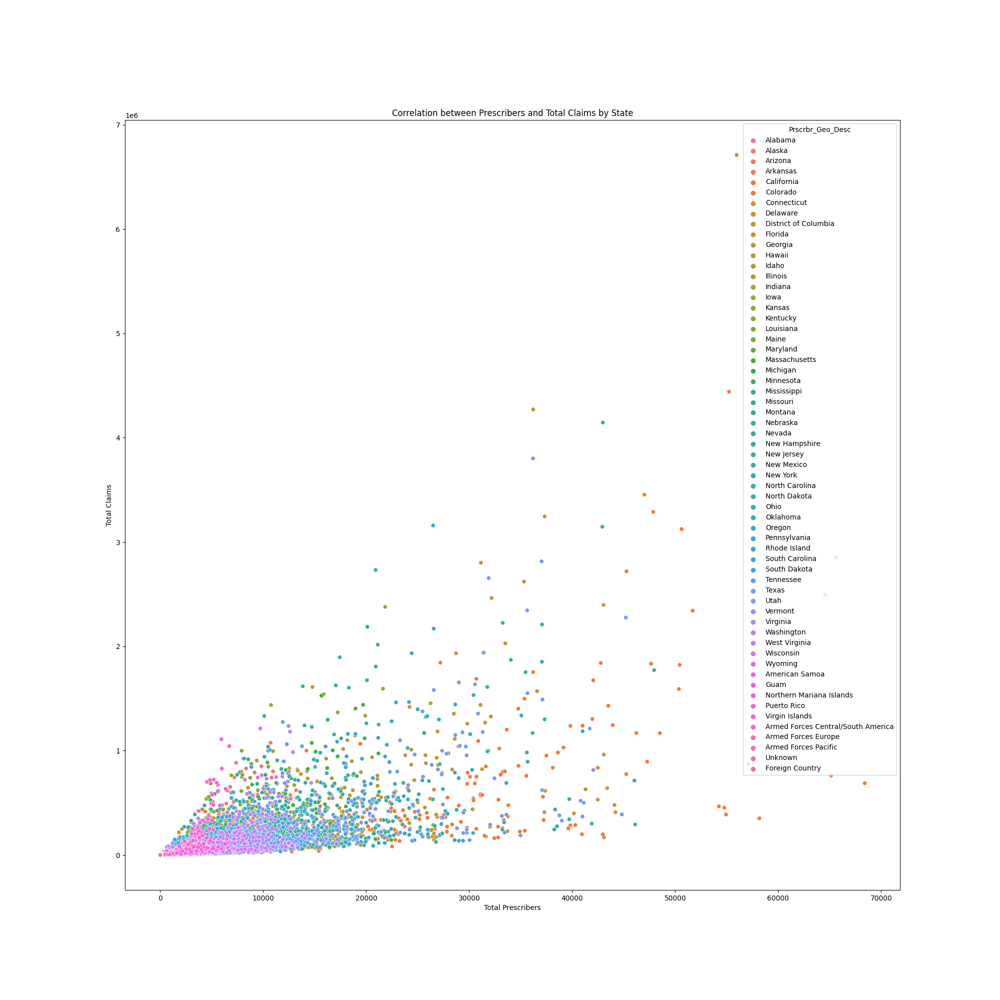

# Medicare-Part-D-Data-Analysis


## Description

This notebook analyzes the [Medicare Part D dataset](https://www.cms.gov/Research-Statistics-Data-and-Systems/Statistics-Trends-and-Reports/Medicare-Provider-Charge-Data/Part-D-Prescriber.html) to provide insights into prescription patterns, costs, and beneficiary information at the US state level. The analysis covers various aspects, including the correlation between prescribers and total claims, top prescribed drugs, and cost analysis.
You can access to the dataset dictionary in [HERE](dataset-dictionary.pdf).


## Key User Groups
- Data analysts
- Healthcare professionals
- Researchers in the pharmaceutical industry
- Policy makers in the healthcare sector

## User Objectives
- Understand prescription patterns in Medicare Part D at the state level.
- Identify top prescribed drugs and their associated costs.
- Explore the correlation between prescribers and total claims.
- Gain insights into beneficiary counts and prescription costs by state.

## Visualization
The notebook generates several visualizations, including:

- #### Top 10 Total Prescribers by State:
Bar chart showing the top 10 states with the highest total prescribers.

- #### Top Prescribed Drug by State:
Bar chart displaying the top prescribed drug in each state.

- #### Correlation between Prescribers and Total Claims by State:
Scatter plot illustrating the correlation between the total number of prescribers and total claims by state.

- #### Top Costly Drugs by State:
Bar chart showcasing the top costly drugs in each state.

- #### Top Total Beneficiaries by State:
Bar chart presenting the top states with the highest number of beneficiaries.
Each visualization is saved as an image for easy reference.


## Requirements

    Python 3.x
    pandas
    matplotlib
    seaborn
    notebook

## How to Run
- Ensure you have Python installed on your system.
- Install the required packages: pip install pandas matplotlib seaborn notebook.
- Download the project and Navigate to the Notebook's Directory.
- Launch Jupyter Notebook:
  - Run the following command to start the Jupyter Notebook server:

    ```bash

    jupyter notebook
    ```
    This will open a new tab in your web browser showing the Jupyter Notebook dashboard.

- Access the Notebook:
In the Jupyter Notebook dashboard, find and click on the name of the notebook file (e.g., main.ipynb).

- Run the Notebook:
Inside the notebook, you can run individual cells by selecting them and pressing Shift + Enter or use the "Run" button in the toolbar.  


